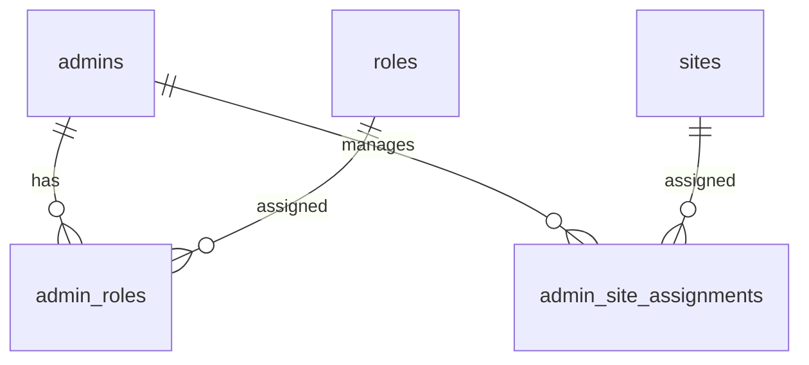
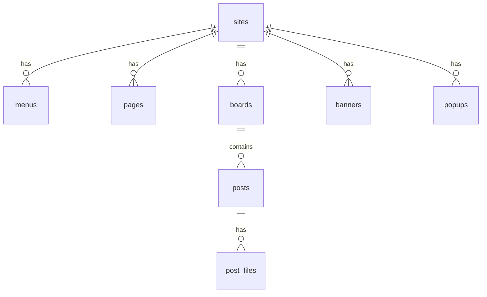
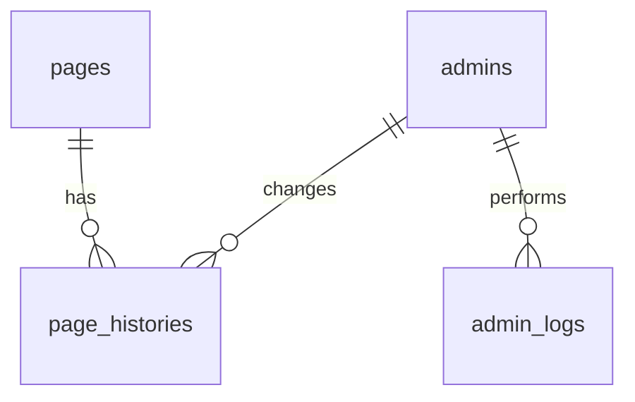

# DB 설계 초안

## 1. 문서 목적

본 문서는 대학 부속홈페이지 통합관리 CMS의 1차 데이터베이스 설계를 정리하기 위한 문서입니다.

요구사항정의서에서 정리한 관리자 인증, 역할관리, 사이트 관리, 메뉴 관리, 페이지 관리, 게시판 관리, 첨부파일 관리, 배너/팝업 관리, 페이지 수정 이력, 관리자 작업 로그 기능을 기준으로 필요한 테이블과 관계를 정의합니다.

본 문서는 초기 설계 문서이며, 실제 구현 과정에서 테이블명, 컬럼명, 자료형, 관계는 변경될 수 있습니다.

## 2. 1차 설계 범위

1차 개발에서는 아래 범위를 기준으로 DB를 설계합니다.

* 하나의 CMS에서 여러 부속 홈페이지를 관리한다.
* 관리자는 역할에 따라 접근 가능한 기능이 달라진다.
* 사이트별로 메뉴, 페이지, 게시판, 배너, 팝업을 관리한다.
* 게시판은 게시글과 첨부파일을 가진다.
* 수정 이력은 우선 일반 페이지를 대상으로 관리한다.
* 첨부파일은 우선 게시글을 대상으로 관리한다.
* 관리자 주요 작업은 로그로 기록한다.

## 3. 명명 기준

본 프로젝트에서는 관리자 계정만 로그인 대상으로 다룹니다.

일반 방문자는 홈페이지를 조회하는 대상이며, 별도의 로그인 계정으로 관리하지 않습니다.
따라서 로그인 계정 테이블명은 `users`가 아니라 `admins`로 정의합니다.

또한 1차 개발에서 첨부파일은 게시글에만 연결하므로, 첨부파일 테이블명은 범용적인 `files`가 아니라 `post_files`로 정의합니다.

`roles`는 개별 기능 권한이 아니라 최고관리자, 사이트관리자, 콘텐츠관리자처럼 관리자 역할을 구분하기 위한 테이블입니다.

## 4. 주요 테이블 목록

| 테이블명                   | 설명          |
| ---------------------- | ----------- |
| admins                 | 관리자 계정      |
| roles                  | 관리자 역할      |
| admin_roles            | 관리자와 역할 연결  |
| sites                  | 부속 홈페이지     |
| admin_site_assignments | 사이트와 관리자 연결 |
| menus                  | 사이트별 메뉴     |
| pages                  | 일반 페이지      |
| page_histories         | 페이지 수정 이력   |
| boards                 | 게시판         |
| posts                  | 게시글         |
| post_files             | 게시글 첨부파일    |
| banners                | 사이트별 배너     |
| popups                 | 사이트별 팝업     |
| admin_logs             | 관리자 작업 로그   |

## 5. 관계 요약 다이어그램

컬럼 상세는 아래 테이블 상세 항목에서 관리하고, Mermaid 다이어그램은 전체 관계를 이해하기 위한 요약 형태로 작성합니다.

Mermaid 관계도에서 선은 데이터 흐름이 아니라 테이블 간 관계를 의미합니다.

* `||`는 정확히 1개를 의미합니다.
* `o{`는 0개 이상을 의미합니다.
* 선 가운데의 `has`, `assigned`, `manages`, `contains`, `performs` 등은 관계를 읽기 쉽게 붙인 설명입니다.

### 5.1 관리자 역할 및 사이트 담당 관계



### 5.2 사이트 콘텐츠 구조



### 5.3 이력 및 운영 로그 구조



## 6. 공통 상태값 기준

아래 테이블의 `status`는 기본적으로 다음 값을 사용합니다.

| 값        | 의미    |
| -------- | ----- |
| active   | 사용 중  |
| inactive | 사용 중지 |

`status`는 관리자 계정, 사이트, 게시판처럼 관리 대상 자체의 사용 상태를 의미합니다.

`is_active`는 배너나 팝업처럼 화면 노출 여부를 빠르게 판단하기 위한 값으로 사용합니다.

1차 개발에서는 관리 대상에 따라 처리 방식을 구분합니다.

사이트처럼 운영 기준이 중요한 관리 대상은 실제 삭제보다 `status`를 `inactive`으로 변경하는 방식으로 사용 중지 처리합니다.

게시글, 첨부파일 등 일부 데이터의 삭제 정책은 각 기능 구현 단계에서 별도로 결정하며, 향후에는 `deleted` 상태값을 추가하거나 `deleted_at` 컬럼을 사용하는 soft delete 방식을 검토합니다.

## 7. 테이블 상세

### 7.1 admins

관리자 계정 정보를 저장합니다.

일반 방문자는 로그인하지 않고 홈페이지를 조회만 하며, 이 테이블에는 최고관리자, 사이트관리자, 콘텐츠관리자처럼 관리자 화면에 로그인하는 계정만 저장합니다.

| 컬럼명           | 설명          |
| ------------- | ----------- |
| id            | 관리자 ID      |
| username      | 로그인 아이디     |
| password_hash | 해시 처리된 비밀번호 |
| name          | 관리자 이름      |
| email         | 이메일         |
| status        | 계정 상태       |
| created_at    | 생성일시        |
| updated_at    | 수정일시        |

### 7.2 roles

관리자 역할 정보를 저장합니다.

`roles`는 개별 기능 권한이 아니라 관리자 역할 구분을 위한 테이블입니다.

| 컬럼명         | 설명    |
| ----------- | ----- |
| id          | 역할 ID |
| name        | 역할명   |
| description | 역할 설명 |

역할 예시는 다음과 같습니다.

| 역할명           | 설명     |
| ------------- | ------ |
| super_admin   | 최고관리자  |
| site_admin    | 사이트관리자 |
| content_admin | 콘텐츠관리자 |

### 7.3 admin_roles

관리자와 역할의 연결 정보를 저장합니다.

| 컬럼명      | 설명     |
| -------- | ------ |
| admin_id | 관리자 ID |
| role_id  | 역할 ID  |

한 관리자가 여러 역할을 가질 수 있도록 `admins`와 `roles`를 분리하고, `admin_roles`로 연결합니다.

예를 들어 한 관리자가 사이트관리자이면서 콘텐츠관리자 역할도 함께 가질 수 있습니다.

### 7.4 sites

부속 홈페이지 정보를 저장합니다.

| 컬럼명         | 설명     |
| ----------- | ------ |
| id          | 사이트 ID |
| site_code   | 사이트 코드 |
| name        | 사이트명   |
| description | 사이트 설명 |
| status      | 사용 상태  |
| created_at  | 생성일시   |
| updated_at  | 수정일시   |

사이트 예시는 다음과 같습니다.

| 사이트명    | 설명        |
| ------- | --------- |
| 문헌정보학과  | 학과 홈페이지   |
| 미래융합연구원 | 연구원 홈페이지  |
| 산학협력단   | 부속기관 홈페이지 |
| 도서관     | 부속기관 홈페이지 |

### 7.5 admin_site_assignments

특정 관리자가 어떤 사이트를 담당하는지 저장합니다.

| 컬럼명      | 설명     |
| -------- | ------ |
| site_id  | 사이트 ID |
| admin_id | 관리자 ID |

사이트관리자와 콘텐츠관리자는 담당 사이트만 관리할 수 있어야 하므로, `sites`와 `admins`의 연결 테이블을 둡니다.

최고관리자는 별도의 사이트 배정 없이 전체 사이트를 관리할 수 있으며, `admin_site_assignments`는 주로 사이트관리자와 콘텐츠관리자의 담당 사이트 범위를 제한하기 위해 사용합니다.

예를 들어 문헌정보학과 사이트는 A 관리자와 B 관리자가 담당할 수 있고, 한 관리자가 여러 사이트를 담당할 수도 있습니다.

### 7.6 menus

사이트별 메뉴 정보를 저장합니다.

| 컬럼명        | 설명       |
| ---------- | -------- |
| id         | 메뉴 ID    |
| site_id    | 사이트 ID   |
| parent_id  | 상위 메뉴 ID |
| name       | 메뉴명      |
| menu_type  | 연결 유형    |
| target_id  | 연결 대상 ID |
| link_url   | 외부 링크    |
| sort_order | 정렬 순서    |
| is_visible | 노출 여부    |
| created_at | 생성일시     |
| updated_at | 수정일시     |

`parent_id`는 상위 메뉴 ID를 의미하며, 값이 없으면 최상위 메뉴로 취급합니다.

예를 들어 아래와 같은 메뉴 구조를 표현할 수 있습니다.

```text
학과소개
 ├─ 인사말
 └─ 오시는 길
```

메뉴 연결 유형은 다음과 같습니다.

| menu_type | 의미        |
| --------- | --------- |
| page      | 일반 페이지 연결 |
| board     | 게시판 연결    |
| link      | 외부 링크 연결  |

예를 들어 `menu_type`이 `page`이고 `target_id`가 3이면, 해당 메뉴는 `pages` 테이블의 3번 페이지와 연결됩니다.

`menu_type`이 `board`이고 `target_id`가 1이면, 해당 메뉴는 `boards` 테이블의 1번 게시판과 연결됩니다.

`menu_type`이 `link`이면, `target_id` 대신 `link_url` 값을 사용해 외부 링크로 이동할 수 있습니다.

`target_id`는 `menu_type`에 따라 참조 대상이 달라지므로, 실제 구현 시 저장 단계에서 유효성 검사를 수행합니다.

### 7.7 pages

일반 페이지 정보를 저장합니다.

| 컬럼명        | 설명         |
| ---------- | ---------- |
| id         | 페이지 ID     |
| site_id    | 사이트 ID     |
| title      | 페이지 제목     |
| content    | 페이지 내용     |
| created_by | 작성한 관리자 ID |
| updated_by | 수정한 관리자 ID |
| created_at | 생성일시       |
| updated_at | 수정일시       |

일반 페이지는 학과소개, 인사말, 오시는 길처럼 비교적 고정적인 콘텐츠를 의미합니다.

`created_by`, `updated_by`는 `admins.id`를 참조합니다.

### 7.8 page_histories

페이지 수정 이력을 저장합니다.

| 컬럼명        | 설명         |
| ---------- | ---------- |
| id         | 이력 ID      |
| page_id    | 페이지 ID     |
| title      | 수정 전 제목    |
| content    | 수정 전 내용    |
| changed_by | 수정한 관리자 ID |
| changed_at | 수정일시       |

`pages`는 현재 내용을 저장하고, `page_histories`는 수정 전 내용을 저장합니다.

하나의 페이지는 여러 번 수정될 수 있으므로, `pages`와 `page_histories`는 1:N 관계입니다.

`changed_by`는 `admins.id`를 참조합니다.

1차 개발에서는 페이지 수정 이력만 관리하고, 게시글 수정 이력은 향후 검토 사항으로 둡니다.

### 7.9 boards

게시판 정보를 저장합니다.

| 컬럼명        | 설명     |
| ---------- | ------ |
| id         | 게시판 ID |
| site_id    | 사이트 ID |
| name       | 게시판명   |
| board_type | 게시판 유형 |
| status     | 사용 상태  |
| created_at | 생성일시   |
| updated_at | 수정일시   |

게시판 유형 예시는 다음과 같습니다.

| board_type | 의미   |
| ---------- | ---- |
| notice     | 공지사항 |
| resource   | 자료실  |
| faq        | FAQ  |

자료실 게시판은 `resource`로 표현합니다.
`file`이라는 명칭은 첨부파일 테이블인 `post_files`와 헷갈릴 수 있으므로 사용하지 않습니다.

### 7.10 posts

게시글 정보를 저장합니다.

| 컬럼명        | 설명         |
| ---------- | ---------- |
| id         | 게시글 ID     |
| board_id   | 게시판 ID     |
| title      | 제목         |
| content    | 내용         |
| is_notice  | 공지글 여부     |
| view_count | 조회수        |
| created_by | 작성한 관리자 ID |
| updated_by | 수정한 관리자 ID |
| created_at | 생성일시       |
| updated_at | 수정일시       |

하나의 게시판은 여러 게시글을 가질 수 있으므로, `boards`와 `posts`는 1:N 관계입니다.

`created_by`, `updated_by`는 `admins.id`를 참조합니다.

### 7.11 post_files

게시글 첨부파일 정보를 저장합니다.

| 컬럼명           | 설명          |
| ------------- | ----------- |
| id            | 파일 ID       |
| post_id       | 게시글 ID      |
| original_name | 원본 파일명      |
| stored_name   | 저장 파일명      |
| file_path     | 파일 경로       |
| file_size     | 파일 크기       |
| file_ext      | 파일 확장자      |
| uploaded_by   | 업로드한 관리자 ID |
| created_at    | 생성일시        |

1차 개발에서는 첨부파일을 게시글에만 연결합니다.

`uploaded_by`는 `admins.id`를 참조합니다.

배너나 팝업 이미지는 각각 `banners`, `popups` 테이블에서 경로를 관리하고, 추후 필요하면 공통 파일 관리 구조로 확장할 수 있습니다.

### 7.12 banners

사이트별 배너 정보를 저장합니다.

| 컬럼명        | 설명     |
| ---------- | ------ |
| id         | 배너 ID  |
| site_id    | 사이트 ID |
| title      | 배너 제목  |
| image_path | 이미지 경로 |
| link_url   | 연결 URL |
| start_date | 노출 시작일 |
| end_date   | 노출 종료일 |
| is_active  | 사용 여부  |
| created_at | 생성일시   |

배너는 메인 화면에서 홍보 이미지나 주요 안내 링크를 노출하기 위한 기능입니다.

### 7.13 popups

사이트별 팝업 정보를 저장합니다.

| 컬럼명        | 설명     |
| ---------- | ------ |
| id         | 팝업 ID  |
| site_id    | 사이트 ID |
| title      | 팝업 제목  |
| content    | 팝업 내용  |
| start_date | 노출 시작일 |
| end_date   | 노출 종료일 |
| is_active  | 사용 여부  |
| created_at | 생성일시   |

팝업은 특정 기간 동안 공지사항, 행사 안내, 시스템 점검 안내 등을 강조해서 노출하기 위한 기능입니다.

1차 개발에서는 텍스트 팝업을 기준으로 설계하며, 이미지 팝업은 향후 검토 사항으로 둡니다.

### 7.14 admin_logs

관리자 작업 로그를 저장합니다.

| 컬럼명         | 설명       |
| ----------- | -------- |
| id          | 로그 ID    |
| admin_id    | 관리자 ID   |
| action      | 작업 유형    |
| target_type | 작업 대상 유형 |
| target_id   | 작업 대상 ID |
| ip_address  | IP 주소    |
| created_at  | 작업 일시    |

관리자 작업 로그는 로그인, 등록, 수정, 삭제 등 주요 작업을 추적하기 위해 사용합니다.

`target_type`과 `target_id`를 통해 어떤 기능의 어떤 데이터를 대상으로 작업했는지 기록합니다.

`target_type`과 `target_id`는 게시글, 페이지, 배너, 첨부파일 등 여러 대상의 작업 이력을 공통으로 기록하기 위한 값입니다. 대상 테이블이 상황에 따라 달라지므로, 실제 DB 외래키보다는 애플리케이션 로직에서 유효성을 관리합니다.

예시는 다음과 같습니다.

| action | target_type | 의미      |
| ------ | ----------- | ------- |
| login  | admin       | 관리자 로그인 |
| create | post        | 게시글 등록  |
| update | page        | 페이지 수정  |
| delete | post_file   | 첨부파일 삭제 |
| update | banner      | 배너 수정   |

## 8. 주요 관계 요약

| 관계                                | 설명                           |
| --------------------------------- | ---------------------------- |
| `admins → admin_roles`            | 한 관리자는 여러 역할 연결 정보를 가질 수 있다  |
| `roles → admin_roles`             | 하나의 역할은 여러 관리자에게 부여될 수 있다    |
| `admins → admin_site_assignments` | 한 관리자는 여러 사이트를 담당할 수 있다      |
| `sites → admin_site_assignments`  | 하나의 사이트는 여러 관리자를 가질 수 있다     |
| `sites → menus`                   | 하나의 사이트는 여러 메뉴를 가질 수 있다      |
| `sites → pages`                   | 하나의 사이트는 여러 일반 페이지를 가질 수 있다  |
| `sites → boards`                  | 하나의 사이트는 여러 게시판을 가질 수 있다     |
| `sites → banners`                 | 하나의 사이트는 여러 배너를 가질 수 있다      |
| `sites → popups`                  | 하나의 사이트는 여러 팝업을 가질 수 있다      |
| `boards → posts`                  | 하나의 게시판은 여러 게시글을 가질 수 있다     |
| `posts → post_files`              | 하나의 게시글은 여러 첨부파일을 가질 수 있다    |
| `pages → page_histories`          | 하나의 페이지는 여러 수정 이력을 가질 수 있다   |
| `admins → page_histories`         | 한 관리자는 여러 페이지 수정 이력을 남길 수 있다 |
| `admins → admin_logs`             | 한 관리자는 여러 작업 로그를 남길 수 있다     |

## 9. 향후 검토 사항

* 콘텐츠관리자의 역할 범위를 더 세분화할지 검토한다.
* 역할 기반 관리 외에 기능 단위 권한 테이블을 추가할지 검토한다.
* 게시글 삭제를 실제 삭제로 처리할지, 상태값 변경으로 처리할지 검토한다.
* 게시글 수정 이력까지 관리할지 검토한다.
* 첨부파일을 게시글 외에 페이지, 배너, 팝업에서도 공통으로 사용할지 검토한다.
* 페이지 수정 이력에서 이전 버전으로 복구하는 롤백 기능까지 구현할지 검토한다.
* 관리자 작업 로그에 변경 전/후 데이터를 함께 저장할지 검토한다.
* 배너와 팝업 이미지 파일을 별도 파일 테이블로 분리할지 검토한다.
* 이미지 팝업 기능을 추가할지 검토한다.
